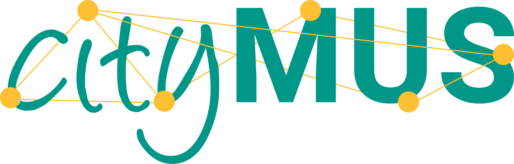

<section class="project" markdown="1">
# DOREMUS: DOing REusable MUSical data

> FR ANR (2014-2018)  
Consortium: 3 academic and 5 industrial partner

DOREMUS is a research project based on the semantic web technologies, aiming to develop tools and methods to describe, publish, connect and contextualize music catalogues on the web of data. Its primary objective is to provide common knowledge models and shared multilingual controlled vocabularies.

[SITE](http://www.doremus.org) 
[DATA](http://data.doremus.org)
[CODE](https://github.com/DOREMUS-ANR)

</section>

# Demos.
<article markdown="1" class="demo">
## 

**_cityMus_** is a web application that gives to the user the experience of a walk in the city with the most suitable soundtrack, on the base of the urban context.  

[DEMO](https://citymus.doremus.org) - [REPO](https://github.com/D2KLab/CityMUS)

</article>

<article markdown="1" class="demo">

## 

HyperTED is an innovative web app that offers a unique and innovative way for exploring over 1681 TED talks at the fragment level. It applies semantic tools on subtitles in order to suggest related chapters and interesting contents.  

**Top 10** @[LinkedUp Vici Challenge](http://linkedup-project.eu/2014/10/14/vici-shortlist-hyperted/)  

[DESCR](https://linkedup-project.eu/files/2014/11/D5.3_card_26_hyper.pdf)

</article>
